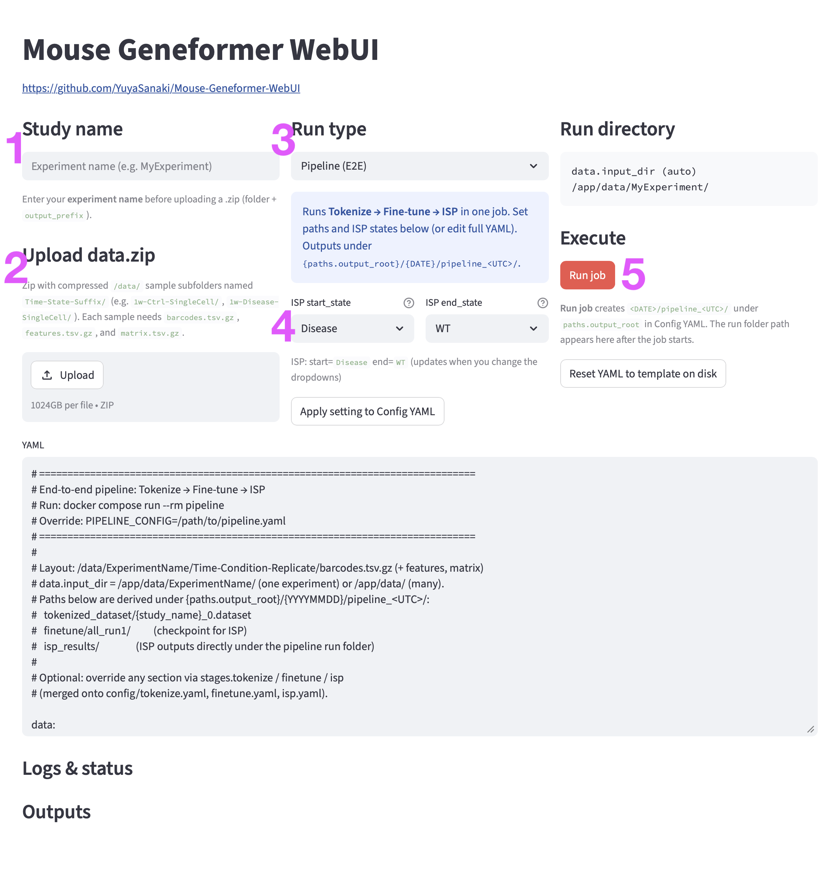

# Mouse Geneformer WebUI

This is a refactored clone of [mouse-Geneformer](https://github.com/machine-perception-robotics-group/Mouse-Geneformer). It runs on an NVIDIA GPU workstation or server with Docker. All services use Docker Compose (the upstream repo used Jupyter). You can run jobs from the **Web UI** or the **CLI**.


## Requirements

| Component | Requirement |
|-----------|-------------|
| **GPU** | NVIDIA GPU with drivers installed |
| **Container runtime** | Docker + [NVIDIA Container Toolkit](https://docs.nvidia.com/datacenter/cloud-native/container-toolkit/install-guide.html) |
| **CPU / OS** | Linux **x86\_64** or **aarch64 / ARM64** (e.g. DGX Spark) |

Primary testing is on **DGX Spark (aarch64)**; x86\_64 NVIDIA hosts are supported. Docker selects the matching image architecture.

**Not supported:** CPU-only, non-NVIDIA GPUs, or macOS GPU.

<a id="install"></a>

## Install

1. **Clone** and enter the repository:
   ```bash
   git clone https://github.com/YuyaSanaki/Mouse-Geneformer-WebUI
   cd Mouse-Geneformer-WebUI
   ```

2. **Git Large Files:**
   ```bash
   git lfs install
   git lfs pull
   ```

3. **Build the image** (Streamlit, ISP, tokenize, pipeline, fine-tune):
   ```bash
   docker compose build mouse-geneformer
   ```
   Re-run after `Dockerfile` or dependency changes.

4. **Mouse-Genecorpus-20M:**
   ```bash
   cd data/Mouse-Genecorpus-20M
   git lfs pull
   cd ../..
   ```

5. **`MLM-re_token_dictionary_v1.pkl`** — if missing after LFS pull, download into `data/Mouse-Genecorpus-20M/`:
   - [MLM-re_token_dictionary_v1.pkl](https://huggingface.co/datasets/MPRG/Mouse-Genecorpus-20M/resolve/main/MLM-re_token_dictionary_v1.pkl)
   ```bash
   wget -O data/Mouse-Genecorpus-20M/MLM-re_token_dictionary_v1.pkl \
     'https://huggingface.co/datasets/MPRG/Mouse-Genecorpus-20M/resolve/main/MLM-re_token_dictionary_v1.pkl'
   ```

---

<a id="streamlit-web-ui"></a>

## Quick start (Web UI — Pipeline E2E)

After [Install](#install), run the full **Tokenize → Fine-tune → ISP** pipeline from the browser (same as `run_pipeline.py` on the CLI).

```bash
docker compose up -d webui
```

Open **http://localhost:8501** ([Mouse-Geneformer-WebUI](https://github.com/YuyaSanaki/Mouse-Geneformer-WebUI)).

1. **Study name** — your experiment name (e.g. `MyExperiment`; set **before** uploading the zip).
2. **Upload** — **data.zip** with sample folders (`Time-State-Suffix/`, e.g. `1w-Ctrl-SingleCell/`, `1w-Disease-SingleCell/`), each with `barcodes.tsv.gz`, `features.tsv.gz`, and `matrix.tsv.gz`.
3. **Run type** — **Pipeline (E2E)**.
4. **ISP states** — pick **start_state** / **end_state** (e.g. AD, WT) → **Apply setting to Config YAML**.
5. **Run job** — one E2E job at a time; follow **Logs & status** and **Outputs**. When finished, use **Download figures (.zip)** for PNGs under `output/.../pipeline_*/figures/`.

Workflow and YAML fields: [docs/pipeline.md](docs/pipeline.md). Default ISP runs all genes (can take ~30 hours on DGX Spark).

More detail: [docs/web-ui.md](docs/web-ui.md).

---

## CLI

**End-to-end** — edit [`config/pipeline.yaml`](config/pipeline.yaml), then:

```bash
docker compose run --rm pipeline
```

| Step | Command | Doc |
|------|---------|-----|
| Tokenize | `docker compose run --rm tokenize` | [tokenization.md](docs/tokenization.md) |
| Fine-tune | `docker compose run --rm finetune` | [fine-tuning.md](docs/fine-tuning.md) |
| ISP | `docker compose run --rm isp` | [in-silico pertabation.md](docs/in-silico%20pertabation.md) |
| ISP UMAP | `docker compose run --rm isp_umap` | [isp_umap.md](docs/isp_umap.md) |

---

## Documentation

| Topic | Guide |
|-------|--------|
| **Tokenization** | [docs/tokenization.md](docs/tokenization.md) |
| **Fine-tuning** | [docs/fine-tuning.md](docs/fine-tuning.md) |
| **ISP** | [docs/in-silico pertabation.md](docs/in-silico%20pertabation.md) |
| **E2E pipeline** | [docs/pipeline.md](docs/pipeline.md) |
| **ISP UMAP** | [docs/isp_umap.md](docs/isp_umap.md) |
| **Web UI (details)** | [docs/web-ui.md](docs/web-ui.md) |
